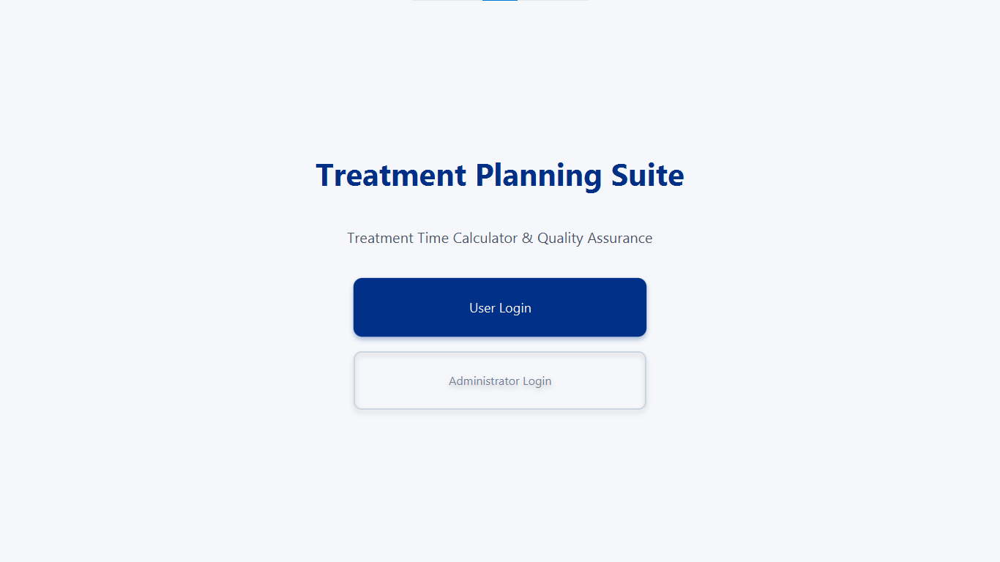
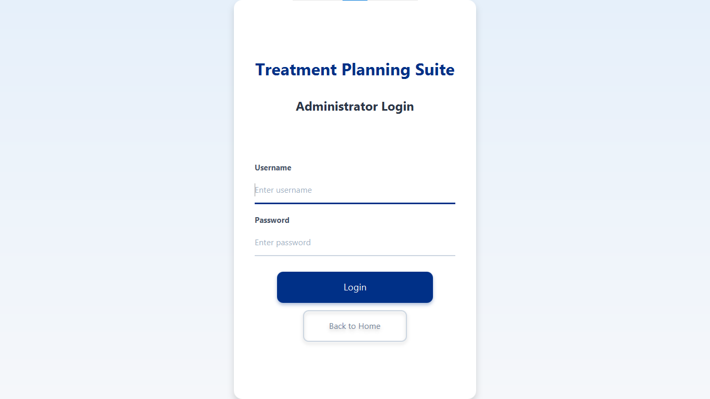
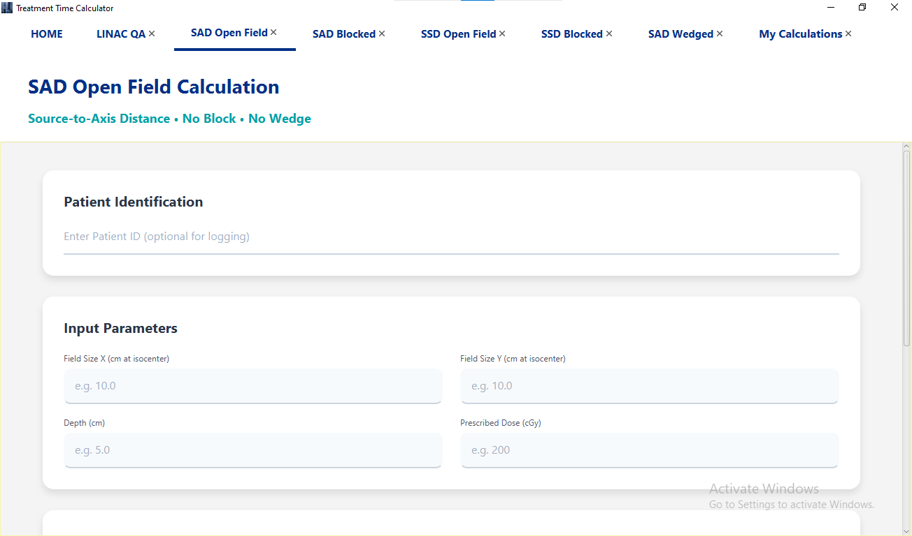
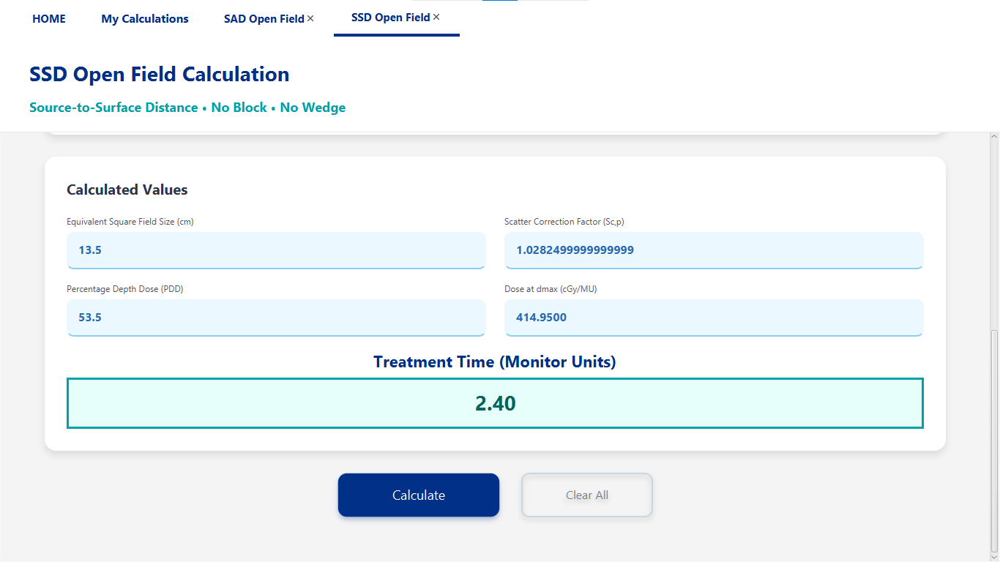
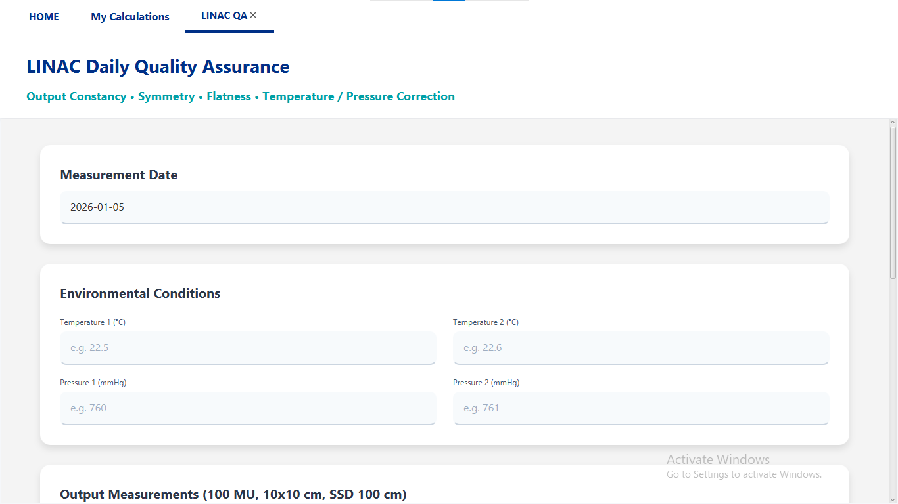
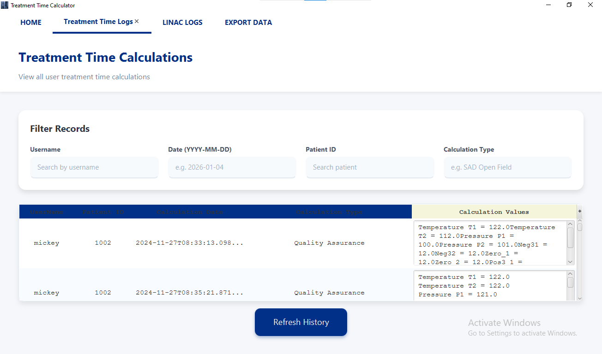
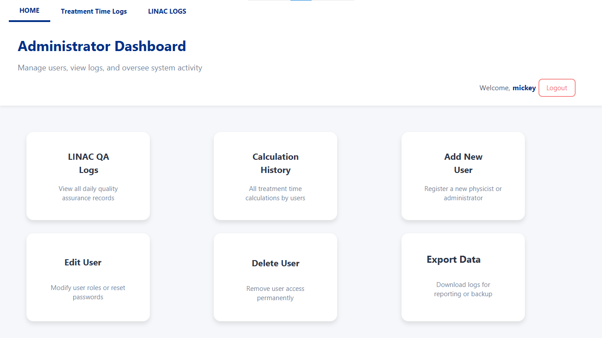

# Treatment Planning Suite - Treatment Time Calculator and Quality Assurance App for Oncology Physics Department

## Overview

**TP Suite** is a desktop application designed specifically for medical physicists in radiation oncology departments. It provides tools for:

- **Treatment time calculations** for external beam radiotherapy using cobalt-60 or linac-equivalent data (SAD/SSD setups, open fields, blocked fields, and wedged fields).
- **Daily LINAC Quality Assurance (QA)** logging with temperature/pressure correction and output constancy checks.
- **Calculation history** tracking per user.
- **Admin dashboard** for user management, log viewing, and data oversight.

The application is built using **JavaFX** for the GUI and **SQLite** (via JDBC) for local data storage. It features role-based access (User and Admin) with password-protected login (MD5 hashed passwords).

## Features

### User Features
- Login-based access with personal calculation history.
- Multiple calculation tabs:
  - SAD Open Field (No Block)
  - SAD Blocked Field
  - SSD Open Field (No Block)
  - SSD Blocked Field
  - SAD Open Field with Wedge
  - LINAC Daily QA (temperature, pressure, symmetry, output checks)
- Automatic lookup of TMR, PDD, Scp, equivalent square, wedge factors, and tray factors from built-in datasets.
- Real-time calculation of monitor units / treatment time.
- History tab with filtering by username, date, patient ID, and calculation type.
- Logout functionality.

### Admin Features
- Separate admin login.
- Dashboard with quick access to:
  - View all LINAC QA logs
  - View all treatment calculations
  - Add new users
  - Edit existing users (username, password, role)
  - Delete users
  - Export/print logs (partial implementation)
- Full visibility into department-wide data.

## Screenshots

  
- Home screen with User/Admin selection
   
- Login screen
  
   
- User calculation interface (SAD/SSD tabs)
   
- LINAC QA entry form
   
- Calculation history table
    
- Admin dashboard  

## Technologies Used

- **Java 25**
- **JavaFX** (for UI)
- **SQLite** (embedded database)
- **JDBC** for database connectivity
- **FXML** for layout design
- MD5 hashing for password storage

## Prerequisites

- Java 25 JDK (or higher)
- JavaFX 25 SDK (included in some JDKs; otherwise download separately)

## Installation & Running the Application

1. **Clone the repository**
   ```bash
   git clone https://github.com/mic-cyberkid/TreatmentPlanningSuite.git
   cd TreatmentPlanningSuite
   ```

2. **Ensure Java 25 and JavaFX are available**

   If using a modular project, configure your IDE (IntelliJ IDEA/Eclipse) to include JavaFX modules.

3. **Database Setup**

   The application uses an embedded SQLite database. On first run, it will create:
   - `users` table
   - `qa_table` (LINAC QA logs)
   - `datalog` (treatment calculations)

   An initial admin user should be created manually in the database or via the admin registration flow (if implemented).

4. **Run the application**

   Start from the `Main` class (not shown in provided files but typically loads `Home.fxml`).

   Example run command (with JavaFX modules):
   ```bash
   java --module-path /path/to/javafx-sdk/lib --add-modules javafx.controls,javafx.fxml -cp . rtpsuite.Main
   ```

5. **First-time Admin Creation**

   - Use database tools (e.g., DB Browser for SQLite) to insert an admin user:
     ```sql
     INSERT INTO users (username, password, role) VALUES ('admin', '21232f297a57a5a743894a0e4a801fc3', 1);
     ```
     (password is "admin" hashed with MD5)

## Usage

1. Launch the app → Choose **USER LOGIN** or **ADMINISTRATOR**.
2. Log in with credentials.
3. For users: Select desired calculation type from the home grid, input field sizes, depth, dose, etc., and press **Calculate**.
4. Results (including treatment time) are displayed and automatically logged.
5. View personal history in the **My Calculations** tab.

Admins have full oversight and user management capabilities.

## Limitations & Future Improvements

- Passwords are stored using MD5 (weak by modern standards) → upgrade to bcrypt/Argon2.
- No data export to PDF/Excel yet (print functionality partially implemented).
- Limited input validation and error handling.
- Hard-coded dataset tables (TMR, PDD, SCP) → could be made configurable.
- No network/multi-user concurrent access (single-user SQLite).

## Contributing

Contributions are welcome! Feel free to:
- Report issues
- Submit pull requests (bug fixes, UI improvements, security upgrades)
- Add new calculation modules (e.g., electron beams, IMRT factors)

Please follow standard GitHub flow: fork → branch → PR.

## License

This project is provided as-is for departmental use in radiation oncology physics. No explicit license is currently assigned; contact the author for usage permissions.

## Author

Michael Okyere (original developer)

---

**RTP Suite** – Streamlining daily physics tasks in radiotherapy.
```
